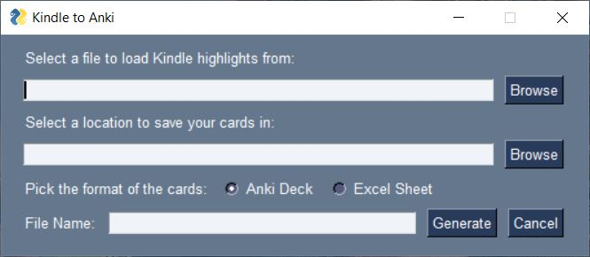

# Kindle-to-Anki
A web-scraping application that takes a word list export from **K**indle highlights and converts them into Japanese-English flashcards compatible with **A**nki.



## Usage
Follow these steps to run the application.

### From Source
1. Install the dependencies
```bash
python3 -m pip install PySimpleGUI pandas bs4 genanki
```
2. Run the script
```bash
python3 src/kindle-to-anki.py
```

### Executable
1. Install the dependencies
```bash
python3 -m pip install PySimpleGUI pandas bs4 genanki PyInstaller
```
2. Build the application
```bash
pyinstaller --onefile --add-data="assets/loading_icon.gif:assets" src/kindle-to-anki.py
```
3. Run the GUI application
```bash
./dist/kindle-to-anki
```

**TIP:** check the [Releases](https://github.com/razagna/Kindle-to-Anki/releases/tag/v1.0.0) section for pre-built executables

## Output
The resulting flash-cards have the following contents and format.

### Contents

The information that gets fetched from [Jisho](https://jisho.org) includes:
- the Japanese word
- its English translation
- a randomly selected example sentence
- the reading of the example sentence with furigana
- the English translations of the example sentence

### Format

Supported output formats are: 
- Excel spreedsheets (.xlsx)
- Anki packages (.apkg)